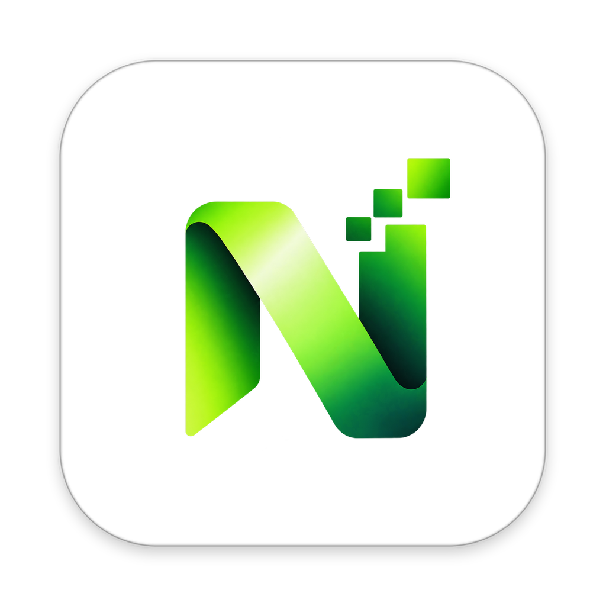

# CoreMind — AI-Native Development Environment

<p align="center">
  
</p>

<p align="center">
  <strong>High-performance, secure, and modular desktop IDE designed for macOS Apple Silicon.</strong>
</p>

---

## 1. What is CoreMind?

**CoreMind** is a next-generation desktop development environment built from the ground up for modern engineering workflows. Engineered specifically for **macOS Apple Silicon (M4)**, CoreMind combines an ultra-fast desktop foundation with a modular, secure architecture designed to host autonomous AI agents, intelligent coding tools, and deep repository context in subsequent phases.

> [!NOTE]
> **Phase 1 Foundation Scope**: This repository currently houses the complete **Phase 1 Desktop Foundation**. Autonomous AI agents, LLM integrations (NVIDIA Nemotron / Nebius Token Factory), RAG, and automated debug loops are planned for **Phase 2**.

---

## 2. Current Development Status

| Feature / Subsystem | Status | Description |
|---|---|---|
| **macOS Native Window** | [Done] Completed | Custom title bar, native traffic lights padding (`hiddenInset`) |
| **Workspace & File Tree** | [Done] Completed | Native directory picker, recursive tree, expand/collapse |
| **File CRUD & Security** | [Done] Completed | Create, read, write, rename, delete with traversal prevention |
| **Monaco Code Editor** | [Done] Completed | TypeScript, Python, Dart, JS, JSON, Markdown with dark theme |
| **Editor Model Manager** | [Done] Completed | In-memory Monaco models preserving scroll, undo, and cursor |
| **Multi-Tab System** | [Done] Completed | Dirty tracking dot (`●`), close confirm, middle-click close |
| **Project Search** | [Done] Completed | Fast text search across files with line preview and jump-to-code |
| **Git Source Control** | [Done] Completed | Git branch detection, porcelain status, modified files |
| **Terminal Interface** | [Done] Completed | xterm.js UI with interactive shell simulation (Phase 1) |
| **Settings Panel** | [Done] Completed | Font size, tab size, minimap, word wrap, app diagnostics |
| **Command Palette & Quick Open** | [Done] Completed | `⌘⇧P` Command Palette, `⌘P` file quick open |
| **macOS arm64 Packaging** | [Done] Completed | Builds standalone `CoreMind.app` and `CoreMind.dmg` |
| **AI / LLM / Autonomous Agent** | [Phase 2] | Scheduled for Phase 2 integration |

---

## 3. Technology Stack

- **Desktop Framework**: [Electron 34](https://www.electronjs.org/) (Sandboxed, Context Isolated)
- **Frontend Framework**: [React 18](https://react.dev/) & [TypeScript 5](https://www.typescriptlang.org/)
- **Bundler & Tooling**: [Vite 6](https://vitejs.dev/) with `vite-plugin-electron`
- **Code Editor Engine**: [Monaco Editor](https://microsoft.github.io/monaco-editor/) (Fully local/offline)
- **Terminal UI**: [xterm.js](https://xtermjs.org/) & `xterm-addon-fit`
- **State Management**: [Zustand 5](https://github.com/pmndrs/zustand) (Domain-driven isolated stores)
- **Iconography**: [Lucide React](https://lucide.dev/)
- **Testing Framework**: [Vitest](https://vitest.dev/)
- **Distribution Packager**: [electron-builder](https://www.electron.build/)

---

## 4. Architecture Overview

```text
                                CoreMind.app
                                     │
                             Electron Main Process
                         (src/main/main.ts, services/)
                                     │
                        ┌────────────┴────────────┐
                        │                         │
                  Preload Layer           Renderer Process
               (src/preload/preload.ts)  (React 18 + Zustand)
                        │                         │
                 Secure IPC Bridge       ┌────────┴────────┐
              (window.coreMindAPI)       │   IDELayout     │
                                         └────────┬────────┘
                                                  │
                 ┌────────────────┬───────────────┴───────────────┬────────────────┐
                 │                │                               │                │
            FileExplorer     MonacoEditor                    TerminalPanel    WorkspaceInfo
                 │                │                               │           (Phase 2 Preview)
          FileSystemService  EditorModelManager               xterm.js
                 │                │
        Path Security Gate   Zustand Stores
```

---

## 5. Security & Isolation Architecture

CoreMind implements strict Electron security best practices:

1. **Strict Context Isolation**: `contextIsolation: true` is enforced for all windows.
2. **Node Integration Disabled**: `nodeIntegration: false`. The renderer has **zero** access to Node's `fs`, `child_process`, or global `require`.
3. **Typed IPC Bridge**: The preload layer selectively exposes functionality through `window.coreMindAPI`.
4. **Workspace Path Sandbox (`validateWorkspacePath`)**:
   - All filesystem operations are cryptographically and path-checked against the active `workspaceRoot`.
   - Directory traversal attacks (e.g. `../../etc/passwd` or symlink escapes) are rejected with `ACCESS_DENIED`.
   - The workspace root directory itself cannot be deleted or renamed.

---

## 6. System Requirements

- **Operating System**: macOS 12.0 (Monterey) or later (macOS Sonoma / Sequoia tested)
- **Architecture**: Apple Silicon (`arm64` — M1, M2, M3, M4)
- **Node.js**: v18.x, v20.x, or v22.x
- **Package Manager**: npm v9+

---

## 7. Project Structure

```text
CoreMind-Application/
├── assets/
│   ├── icon.png                  # High-res 1024x1024 macOS app icon
│   └── icon.icns                 # macOS native icon bundle
├── src/
│   ├── main/
│   │   ├── main.ts               # App entrypoint & single-instance lock
│   │   ├── windows/
│   │   │   └── mainWindow.ts     # BrowserWindow factory (hiddenInset titlebar)
│   │   ├── ipc/
│   │   │   └── registerIpcHandlers.ts # Type-safe IPC endpoints
│   │   └── services/
│   │       ├── fileSystemService.ts   # Secure workspace filesystem service
│   │       ├── gitService.ts          # Git CLI wrapper
│   │       ├── logger.ts              # Structured logger
│   │       └── terminalService.ts     # Terminal abstraction
│   ├── preload/
│   │   └── preload.ts            # contextBridge exposing window.coreMindAPI
│   ├── renderer/
│   │   ├── components/           # TitleBar, ActivityBar, StatusBar, Modals
│   │   ├── layouts/              # IDELayout orchestrator
│   │   ├── explorer/             # FileExplorer, FileTree, FileTreeItem
│   │   ├── editor/               # MonacoEditor, EditorTabs, EditorModelManager
│   │   ├── terminal/             # TerminalPanel (xterm.js)
│   │   ├── search/               # SearchPanel (Find in files)
│   │   ├── git/                  # SourceControlPanel
│   │   ├── settings/             # SettingsPanel
│   │   ├── stores/               # Zustand stores (workspace, files, tabs, editor, ui)
│   │   ├── types/                # Renderer declarations
│   │   ├── App.tsx               # Root component & global keyboard shortcuts
│   │   └── index.css             # Bespoke CoreMind dark theme variables
│   └── shared/
│       ├── types/                # IPC, File, Git, Tab, Settings models
│       └── constants.ts          # Default settings & UI bounds
├── tests/                        # Vitest unit test suites
├── vite.config.ts                # Vite multi-target config
├── tsconfig.json                 # Strict TypeScript configuration
└── package.json                  # Scripts & dependencies
```

---

## 8. Development & Build Commands

### Install Dependencies
```bash
npm install
```

### Run in Development Mode
Launches Vite dev server with Hot Module Reloading (HMR) and Electron:
```bash
npm run dev
```

### Typecheck & Lint
```bash
npm run typecheck
npm run lint
```

### Run Automated Tests
```bash
npm run test
```

### Build Production Bundle
Compiles TypeScript, bundles renderer with Vite, and builds Electron main/preload:
```bash
npm run build
```

### Package for macOS (Apple Silicon arm64)
Creates standalone `CoreMind.app` and `CoreMind.dmg` installer inside `release/`:
```bash
npm run package
```

---

## 9. Keyboard Shortcuts

| Shortcut | Action |
|---|---|
| `⌘ P` | Quick Open files |
| `⌘ ⇧ P` | Command Palette |
| `⌘ S` | Save active file |
| `⌘ W` | Close active editor tab |
| `⌘ B` | Toggle primary sidebar |
| `⌘ J` | Toggle integrated terminal |
| `⌘ ⇧ F` | Search in workspace files |

---

## 10. Phase 2 Roadmap: AI-Native Capabilities

Phase 2 will introduce AI engineering directly into the established CoreMind architecture:

1. **Python FastAPI Sidecar / Backend**: Local inference client and repository indexing engine.
2. **NVIDIA Nemotron Integration**: LLM inference orchestration optimized for code generation and analysis.
3. **Nebius Token Factory**: Cloud acceleration and API routing.
4. **Autonomous Agent Loop**: Plan ➔ Code ➔ Test ➔ Debug ➔ Verify loop.
5. **Interactive AI Chat & Inline Ghost Text**: Right-panel AI assistant with context awareness and inline code completion.
6. **node-pty Terminal Process Execution**: Live pseudo-terminal running sandboxed commands and automated test execution.

---

## 11. License

MIT License. See [LICENSE](LICENSE) for full details.
